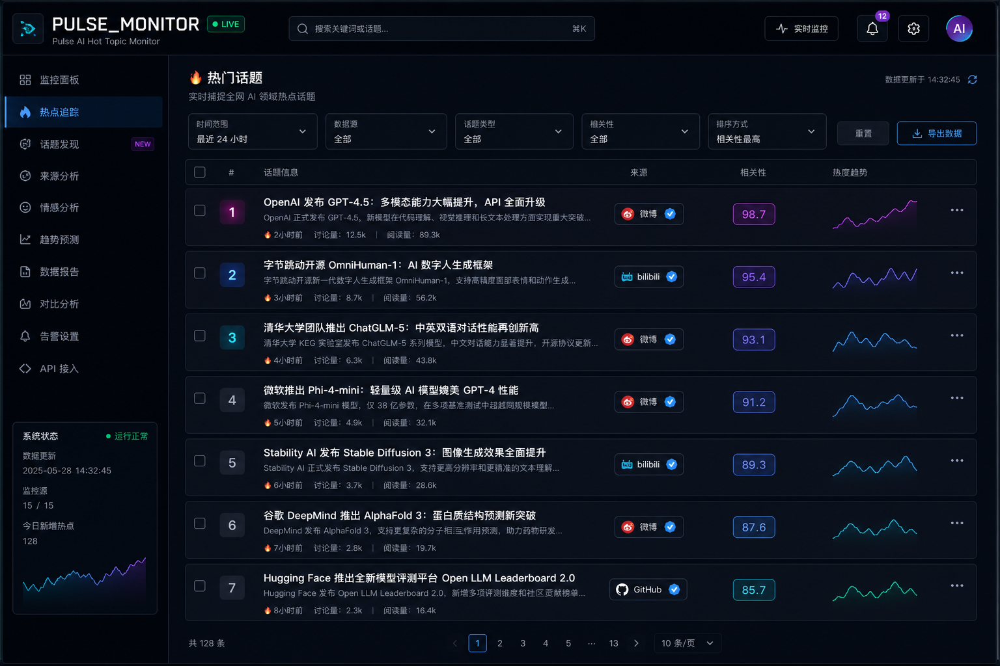
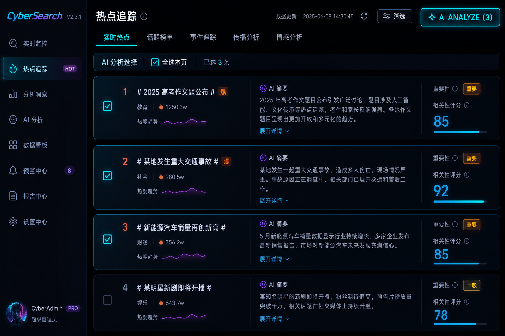
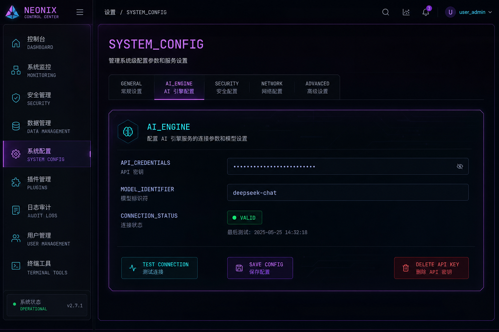
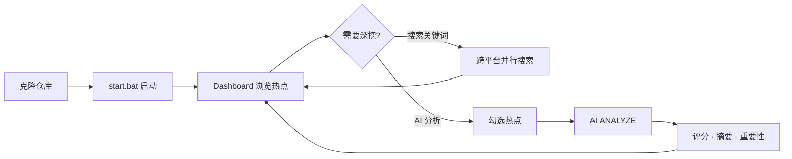
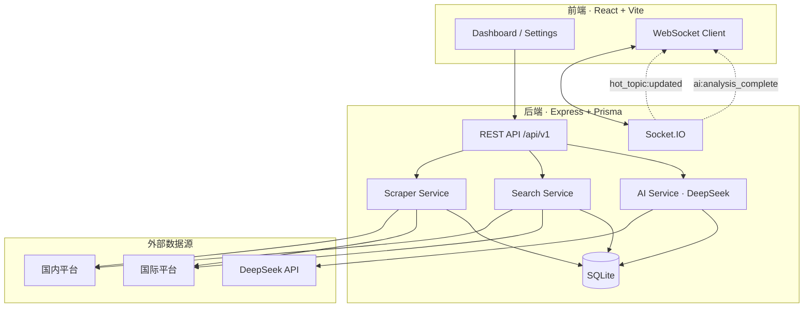

<div align="center">

# ⚡ Pulse · AI 热点监控与决策助手

**一条命令，聚合全网热点 · 勾选即分析 · 实时推送**

[](https://nodejs.org/)
[](https://react.dev/)
[](https://www.typescriptlang.org/)
[](https://expressjs.com/)
[](https://www.prisma.io/)
[](https://socket.io/)
[](#-license)

[快速开始](#-30-秒快速开始) · [界面预览](#-界面预览) · [功能亮点](#-核心亮点) · [文档](#-文档) · [Issue](https://github.com/Drgonmancer/AI-real-time-buzz-tracker/issues)

---

> 告别「十几个 App 来回切」——  
> **百度 / 微博 / B 站 / GitHub / HN / Reddit / Google News** 等热点，一个 Dashboard 全看完。  
> 配好 DeepSeek，勾选几条热点，AI 帮你打分、摘要、判断要不要跟。

</div>

---

## 📸 界面预览

<div align="center">



<p><sub>Dashboard · 多源热点聚合 · 搜索 · 筛选 · LIVE 实时推送</sub></p>

</div>

<table>
<tr>
<td width="50%" align="center">



**勾选式 AI 分析** — 只分析你关心的热点

</td>
<td width="50%" align="center">



**Settings** — API Key 保存 / 测试 / 安全删除

</td>
</tr>
</table>

---

## ✨ 核心亮点

<table>
<tr>
<td width="50%">

### 🌐 多平台聚合

自动定时采集 **15+ 数据源**，统一列表展示。  
支持来源筛选、分类标签、混合排序——不再漏掉任何一条热搜。

</td>
<td width="50%">

### 🔍 关键词跨平台搜索

输入一个词，**并行搜索** B 站、搜狗、微博、Twitter 等。  
结果自动去重入库，各平台成功/失败状态一目了然。

</td>
</tr>
<tr>
<td>

### 🤖 勾选式 AI 分析

**先勾选，再分析**——只对你关心的热点调用 DeepSeek。  
输出相关性评分、中文摘要、重要性、真伪判断、趋势预测。

</td>
<td>

### 📡 实时推送

Socket.IO 驱动，新热点入库 / AI 分析完成 **秒级通知** 前端刷新。  
Dashboard 顶部 **LIVE** 指示灯，数据始终是最新的。

</td>
</tr>
<tr>
<td>

### 🛡️ 零配置开箱即用

**不需要 API Key** 也能跑：采集、搜索、列表、WebSocket 全部可用。  
AI 分析按需开启，Settings 页保存 / 删除 Key，安全可控。

</td>
<td>

### 🖥️ 本地部署，数据在手

SQLite 本地存储，无云依赖，无账号体系。  
Windows 双击 `start.bat`，3 分钟跑起来。

</td>
</tr>
</table>

---

## 📊 支持的数据源

| 国内 | 国际 |
|:--|:--|
| 百度热搜 · 微博 · 抖音 · B 站 · 搜狗 | GitHub Trending · Hacker News |
| | Reddit · Dev.to · Bing News |
| | Google News（中文 / 科技 / AI） |
| | Twitter（可选 Token） |

> 国内源 **开箱即用**；Reddit / GNews 等建议配置代理，详见 [人工配置](docs/人工配置.md)。

---

## 🎬 使用流程



---

## 🚀 30 秒快速开始

### Windows（推荐，一键启动）

```bash
# 1. 克隆
git clone https://github.com/Drgonmancer/AI-real-time-buzz-tracker.git
cd AI-real-time-buzz-tracker

# 2. 双击 start.bat（自动安装依赖 + 初始化数据库 + 启动前后端）

# 3. 浏览器打开
# http://localhost:5173
```

> 前置条件：安装 [Node.js 18+](https://nodejs.org/)（勾选 Add to PATH）

### macOS / Linux

```bash
git clone https://github.com/Drgonmancer/AI-real-time-buzz-tracker.git
cd AI-real-time-buzz-tracker

bash scripts/setup.sh    # 安装依赖 + 初始化 SQLite
npm run dev:server       # 终端 1 — 后端 :3000
npm run dev:client       # 终端 2 — 前端 :5173
```

### 验证启动成功

| 检查项 | 地址 |
|--------|------|
| 前端 Dashboard | http://localhost:5173 |
| 后端健康检查 | http://localhost:3000/health |
| REST API | http://localhost:3000/api/v1 |

看到 Dashboard 顶部 **LIVE** 绿灯，等待 1～3 分钟热点列表即有数据。

---

## 🧠 AI 分析（可选）

<table>
<tr><th>步骤</th><th>操作</th></tr>
<tr><td>① 配置 Key</td><td>Settings → 输入 DeepSeek API Key → 测试连接 → 保存</td></tr>
<tr><td>② 设置关键词组</td><td>Settings → 添加你关注的词（如 GPT、开源、大模型）</td></tr>
<tr><td>③ 勾选分析</td><td>Dashboard → 勾选热点 → 点击 <b>AI ANALYZE (N)</b></td></tr>
<tr><td>④ 查看结果</td><td>列表显示评分、摘要、重要性标签、可疑内容警告</td></tr>
</table>

- Key 存储在本地 SQLite，**不会提交到 Git**
- 支持一键 **删除 API Key**，保护隐私
- 未配置 Key 时，采集与搜索 **完全不受影响**

[DeepSeek 开放平台](https://platform.deepseek.com/) 获取 API Key · 配置详解见 [docs/人工配置.md](docs/人工配置.md)

---

## 🏗️ 技术架构



**技术栈：** React 18 · Vite · Tailwind CSS · Framer Motion · Express · Prisma · SQLite · DeepSeek · Socket.IO

---

## 📁 项目结构

```
AI-real-time-buzz-tracker/
├── client/              # 前端 Dashboard + Settings
├── server/              # 后端 API · 爬虫 · AI · WebSocket
│   ├── src/routes/      # REST 路由
│   ├── src/services/    # 爬虫 / 搜索 / AI 核心逻辑
│   └── prisma/          # 数据库 Schema
├── docs/                # 中文技术文档（5 篇）
├── scripts/             # setup.sh（macOS / Linux）
├── start.bat            # Windows 一键启动
├── stop.bat             # Windows 停止服务
└── package.json         # 根目录便捷脚本
```

---

## ⚙️ 能力矩阵

| 功能 | 需要 API Key? | 需要代理? |
|------|:------------:|:--------:|
| 国内热点采集 | ❌ | ❌ |
| Dashboard 列表 / 筛选 / 排序 | ❌ | ❌ |
| 关键词跨平台搜索 | ❌ | 部分国际源需要 |
| WebSocket 实时更新 | ❌ | ❌ |
| AI 智能分析 | ✅ DeepSeek | ❌ |
| Twitter 数据 | ❌ | ✅ Token |
| Reddit / Google News | ❌ | ✅ 建议 |

---

## 📚 文档

| 文档 | 内容 |
|------|------|
| [需求分析](docs/需求分析.md) | 功能需求 · 用户故事 · 业务流程 |
| [技术实现方案](docs/技术实现方案.md) | 架构设计 · 模块说明 · 数据模型 |
| [后端 API 接口](docs/后端API接口.md) | REST API · WebSocket 事件 · 错误码 |
| [快速启动说明](docs/快速启动说明.md) | 安装步骤 · 常见问题 · 端口说明 |
| [人工配置](docs/人工配置.md) | 环境变量 · Settings 配置 · 安全建议 |

---

## 🔧 常用命令

```bash
npm run setup          # 安装全部依赖 + 初始化数据库
npm run dev:server     # 启动后端
npm run dev:client     # 启动前端
npm run test:sources   # 测试各数据源可用性
npm run test:search    # 测试关键词搜索
```

---

## 🤝 贡献 & 反馈

欢迎 Star ⭐、Fork、提 Issue 或 PR！

- **Bug 反馈**：[GitHub Issues](https://github.com/Drgonmancer/AI-real-time-buzz-tracker/issues)
- **功能建议**：同样走 Issues，描述使用场景即可

---

## 📄 License

MIT — 自由使用、修改、分发。

---

<div align="center">

**如果这个项目帮你少刷了半小时热搜，请给一个 Star ⭐**

[⬆ 回到顶部](#-pulse--ai-热点监控与决策助手)

</div>
